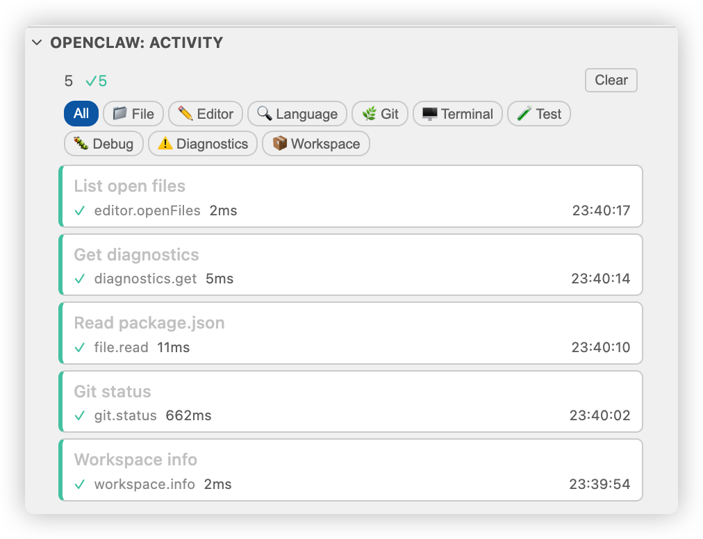
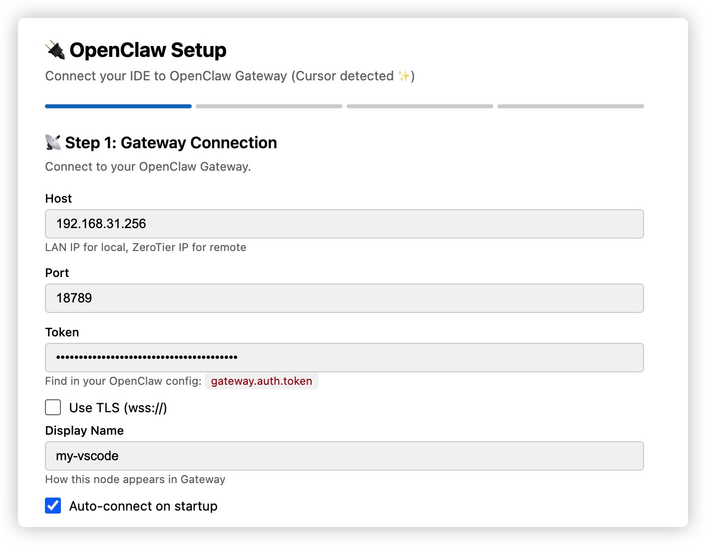

# OpenClaw Node for VS Code / Cursor

<p align="center">
  <strong>Connect your IDE to OpenClaw Gateway as a Node</strong><br>
  Let your AI assistant safely read, write, and navigate code through VS Code APIs.
</p>

<p align="center">
  <a href="#features">Features</a> •
  <a href="#installation">Installation</a> •
  <a href="#quick-start">Quick Start</a> •
  <a href="#commands">Commands</a> •
  <a href="#configuration">Configuration</a> •
  <a href="#security">Security</a> •
  <a href="README.zh-CN.md">中文文档</a>
</p>

---

<p align="center">
  
</p>

## What is this?

This extension turns your VS Code or Cursor editor into an [OpenClaw](https://github.com/openclaw/openclaw) **Node** — a remote-controllable endpoint that exposes IDE capabilities through the Node protocol.

Your AI assistant (running on OpenClaw Gateway) can then:
- 📄 Read, write, and edit files in your workspace
- 🔍 Jump to definitions, find references, get hover info
- 🌿 Check git status, view diffs, stage and commit
- 🧪 Discover and run tests
- 🐛 Launch debuggers, set breakpoints, evaluate expressions
- 🤖 Delegate tasks to Cursor Agent CLI (plan/agent/ask modes)

All operations go through the VS Code Extension API sandbox — **no raw shell access** by default.

## Features

### 40+ IDE Commands
Full coverage of the development workflow:

| Category | Commands |
|----------|----------|
| **File Operations** | `read`, `write`, `edit`, `delete`, `list` |
| **Editor** | `openFiles`, `selections`, `context` (active file + cursor position) |
| **Language Intelligence** | `definition`, `references`, `hover`, `symbols`, `rename`, `codeActions`, `applyCodeAction`, `format` |
| **Diagnostics** | `get` (errors/warnings from all open files) |
| **Git** | `status`, `diff`, `log`, `blame`, `stage`, `unstage`, `commit`, `stash` |
| **Testing** | `list`, `run`, `results` |
| **Debug** | `launch`, `stop`, `breakpoint`, `evaluate`, `stackTrace`, `variables`, `status` |
| **Agent** | `status`, `run`, `setup` (Cursor Agent CLI integration) |
| **Workspace** | `info` (folders, files, extensions) |

### Activity Panel
Every operation from your AI assistant appears in a bottom panel with:
- Human-readable intent descriptions
- Duration and status tracking
- Parameter and result details (expandable)



### Setup Wizard
Guided 4-step setup:
1. **Gateway Connection** — host, port, token
2. **Security** — read-only mode, write confirmation
3. **Terminal** — enable/disable, command whitelist
4. **Agent** — Cursor CLI install, login, model selection



### Cursor Agent CLI Integration
Delegate coding tasks through three modes:
- **Agent** — full access, reads/writes files
- **Plan** — analyzes codebase, proposes changes without executing
- **Ask** — read-only Q&A about the codebase

## Installation

### From VSIX (Current)

Download the latest `.vsix` from [Releases](https://github.com/xiaoyaner-home/openclaw-vscode/releases), then:

```bash
# VS Code
code --install-extension openclaw-node-vscode-x.y.z.vsix

# Cursor
cursor --install-extension openclaw-node-vscode-x.y.z.vsix
```

### From Marketplace (Coming Soon)

```
ext install xiaoyaner-home.openclaw-node-vscode
```

## Quick Start

1. **Install the extension** (see above)
2. **Run the Setup Wizard**: `Cmd/Ctrl+Shift+P` → `OpenClaw: Setup Wizard`
3. **Enter Gateway details**: host, port, and token from your OpenClaw Gateway config
4. **Approve the device**: When the extension connects for the first time, approve it in your Gateway
5. **Start using**: Your AI assistant can now invoke commands via `nodes invoke`

### Test the connection

From your OpenClaw session:
```
nodes invoke --node "Your Node Name" --command workspace.info
```

## Commands

All commands are invoked through the OpenClaw Node protocol (`node.invoke.request`).

### File Operations

| Command | Parameters | Description |
|---------|-----------|-------------|
| `file.read` | `path` | Read file contents |
| `file.write` | `path`, `content` | Write/create a file |
| `file.edit` | `path`, `edits[]` | Apply precise text edits |
| `file.delete` | `path` | Delete a file |
| `file.list` | `path?`, `recursive?`, `pattern?` | List directory contents |

### Editor

| Command | Parameters | Description |
|---------|-----------|-------------|
| `editor.context` | — | Get active file, cursor position, selection |
| `editor.openFiles` | — | List all open editor tabs |
| `editor.selections` | — | Get selections from all editors |

### Language Intelligence

| Command | Parameters | Description |
|---------|-----------|-------------|
| `lang.definition` | `path`, `line`, `character` | Go to definition |
| `lang.references` | `path`, `line`, `character` | Find all references |
| `lang.hover` | `path`, `line`, `character` | Get hover information |
| `lang.symbols` | `path?`, `query?` | Document/workspace symbols |
| `lang.rename` | `path`, `line`, `character`, `newName` | Rename symbol |
| `lang.codeActions` | `path`, `startLine`, `endLine` | Get available code actions |
| `lang.applyCodeAction` | `path`, `startLine`, `endLine`, `title` | Apply a code action |
| `lang.format` | `path` | Format document |

### Diagnostics

| Command | Parameters | Description |
|---------|-----------|-------------|
| `diagnostics.get` | `path?`, `severity?` | Get errors/warnings |

### Git

| Command | Parameters | Description |
|---------|-----------|-------------|
| `git.status` | — | Working tree status |
| `git.diff` | `path?`, `staged?` | View diffs |
| `git.log` | `count?`, `path?` | Commit history |
| `git.blame` | `path` | Line-by-line blame |
| `git.stage` | `paths[]` | Stage files |
| `git.unstage` | `paths[]` | Unstage files |
| `git.commit` | `message` | Create a commit |
| `git.stash` | `action`, `message?` | Stash operations |

### Testing

| Command | Parameters | Description |
|---------|-----------|-------------|
| `test.list` | — | Discover all tests |
| `test.run` | `testIds?`, `grep?` | Run tests |
| `test.results` | — | Get latest test results |

### Debug

| Command | Parameters | Description |
|---------|-----------|-------------|
| `debug.launch` | `config?` | Start debug session |
| `debug.stop` | — | Stop debugging |
| `debug.breakpoint` | `path`, `line`, `action?` | Toggle breakpoints |
| `debug.evaluate` | `expression`, `frameId?` | Evaluate in debug context |
| `debug.stackTrace` | — | Get call stack |
| `debug.variables` | `frameId?` | Get variables |
| `debug.status` | — | Debug session info |

### Agent (Cursor CLI)

| Command | Parameters | Description |
|---------|-----------|-------------|
| `vscode.agent.status` | — | Check CLI availability |
| `vscode.agent.run` | `prompt`, `mode?`, `model?`, `cwd?`, `timeoutMs?` | Run Cursor Agent CLI |
| `vscode.agent.setup` | — | Open setup wizard |

### Workspace

| Command | Parameters | Description |
|---------|-----------|-------------|
| `workspace.info` | — | Workspace folders, file count, extensions |

## Configuration

All settings are under `openclaw.*` in VS Code settings, or use the Settings panel (`Cmd/Ctrl+Shift+P` → `OpenClaw: Settings`).

### Connection

| Setting | Default | Description |
|---------|---------|-------------|
| `openclaw.gatewayHost` | `""` | Gateway hostname or IP |
| `openclaw.gatewayPort` | `18789` | Gateway WebSocket port |
| `openclaw.gatewayToken` | `""` | Authentication token |
| `openclaw.gatewayTls` | `false` | Use wss:// instead of ws:// |
| `openclaw.autoConnect` | `true` | Connect on startup |
| `openclaw.displayName` | `""` | Node display name (shown in `nodes status`) |

### Security

| Setting | Default | Description |
|---------|---------|-------------|
| `openclaw.readOnly` | `false` | Block all write operations |
| `openclaw.confirmWrites` | `false` | Prompt before each write |
| `openclaw.terminal.enabled` | `false` | Allow terminal commands |
| `openclaw.terminal.allowlist` | `[]` | Whitelisted terminal commands |
| `openclaw.commandTimeout` | `90` | Command timeout in seconds |

### Agent

| Setting | Default | Description |
|---------|---------|-------------|
| `openclaw.agent.enabled` | `false` | Enable Cursor Agent CLI |
| `openclaw.agent.cliPath` | `"agent"` | Path to CLI binary |
| `openclaw.agent.defaultMode` | `"agent"` | Default mode (agent/plan/ask) |
| `openclaw.agent.defaultModel` | `""` | Default model (empty = auto) |
| `openclaw.agent.timeoutMs` | `300000` | Agent task timeout |

## Security

### Sandbox Model
All file operations go through the VS Code Extension API — not direct filesystem access. This provides:
- **Path traversal prevention**: Operations restricted to workspace directories
- **No raw shell access**: Terminal commands disabled by default
- **Write protection**: Optional read-only mode and write confirmation prompts

### Terminal Whitelist
When terminal is enabled, only whitelisted commands are allowed:
```json
"openclaw.terminal.allowlist": ["npm test", "npm run build", "git status"]
```

### Device Identity
Each extension instance generates a unique Ed25519 keypair (stored at `~/.openclaw-vscode/device.json`). The Gateway must approve each device before it can execute commands.

### Gateway-Level Controls
The Gateway can further restrict which commands this node is allowed to execute via `gateway.nodes.allowCommands` configuration.

## Development

```bash
# Clone
git clone https://github.com/xiaoyaner-home/openclaw-vscode.git
cd openclaw-vscode

# Install dependencies
npm install

# Build
npm run build

# Package VSIX
npx vsce package --no-dependencies

# Watch mode (for development)
npm run watch
```

## Architecture

```
Extension Host (VS Code/Cursor)
  ├── GatewayClient (WebSocket)     → OpenClaw Gateway
  ├── CommandRegistry (40+ commands) → VS Code Extension API
  ├── ActivityPanel (operation log)  → Bottom panel view
  ├── SecurityGuard (path/cmd validation)
  └── AgentBridge (Cursor CLI)      → Cursor Agent CLI
```

The extension connects to the Gateway as a Node using the standard OpenClaw Node protocol (WebSocket + JSON messages). Commands are registered at startup and listed in `nodes status`. The Gateway dispatches `node.invoke.request` messages, and the extension executes them through the VS Code API.

See [DESIGN.md](DESIGN.md) for detailed architecture documentation.

## Contributing

Contributions welcome! Please see [CONTRIBUTING.md](CONTRIBUTING.md) for guidelines.

## License

MIT — see [LICENSE](LICENSE)

## Links

- [OpenClaw](https://github.com/openclaw/openclaw) — The AI assistant framework
- [OpenClaw Docs](https://docs.openclaw.ai) — Documentation
- [OpenClaw Discord](https://discord.com/invite/clawd) — Community
